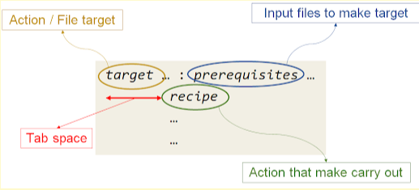
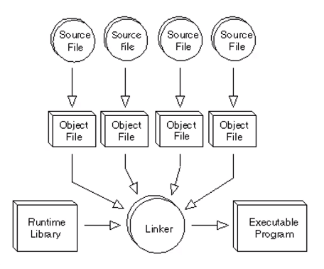

#   **LINUX EMBEDDED**

         
     
     
     
    
 

##  **Table of Contents**

## Lesson 00: Setting Up

### 1. Ubuntu Linux

#### 1.1 What is sudo and apt

- `sudo` stands for **Superuser Do**. It is a command in Linux and Unix system that allows a user to execute tasks requiring **administrative privileges** or **superuser (root) rights** .

- `apt` stands for **Advanced Package Tool**. It is a command-line utility used in Linux distributions based on Debian (such as Ubuntu) to manage software packages. It simplifies the process of installing, updating, and removing software by communicating with the system's package management system.

**Install vim using apt**

The procedure is as follows:
  1. Open terminal application. You can also press `CTRL + ALT + T` keyboard shortcut.
  2. Update package database by typing the `sudo apt update` command
  3. Search for viim package run: `sudo apt search vim`
  4. Install vim on Ubuntu Linux, `type: sudo apt install vim`
  5. Verify vim installation by typing the `vim --version` command

**Install gcc using apt**

`sudo apt install gcc`

**Install make using apt**

`sudo apt install make`

**Install git using apt**

`sudo apt install git`

---

## Lesson 01: General

### 1. Introduction to Makefile

- A Makefile is a special file used by the `make` utility to automate the build process of software projects. It contains a set of rules and instructions to compile and link programs, simplifying repetitive tasks and improving efficiency.
- A Makefile is a script that contains the following information:
  - The structure of a project (files and dependencies).
  - Command lines used to create or delete files.
- The make program will read the content of the Makefile and execute it.

**Structure of a Simple Rule in Makefile**



- **Prereuisites**: These are the files required to create the target.
- **Target**: This is **the file** generated after the `make` process is executed, or it can be **an action mane** such as `build`, `run`, etc.
- **Action**: This refers to the Compile command used to generate the target from the prerequisites, or to execute the target. The action must be indented by one `tab` relative to the target.

Example:
```
hellomake: hello.c main.c
  gcc -o hellomake hello.c main.c -I
```

**Phony Targets**

A phony target is one that is not really the name of a file; rather it is just a name for a recipe to be executed when you make an explicit request. There are two reasons to use a phony target: to avoid a conflict with a file of the same name, and to improve performance. 

**Why use a phony target?**

There are two main reasons:

1. **Avoid conflicts with files of the smae name**
  - If you have a file in your directory with the same name as your target, `make` might think the target is `up to date` and skip running the commands.
  - By marking a target as phony, you tell `make` to ignore the file and always run the commands for the target.
2. **Improve performance**
  - `make` doesn't waste time checking whether the phony target exists as a file. It knows immediately that the target is not a file and executes the commands directly.
  - This especially helpful in large projects wiht many dependencies.

### 2. Compiling a C program

#### 2.1 Pre-processing 

  - Remove comments.
  - Expanding macros.
  - Expanding include files.
  - Compiling conditional statements.
  - The result obtained after this step is a ".i" file.

### 2.2 Compilation (The stage of translating high-level language to assembly)

- At this stage, the source code continues to be compiled from the ".i" file obtained in the previous step into a ".s" file (assembly).

### 2.3 Linking

- Each ".o" file obtained in the assembly stage is part of the program.
- In the linking stage, these files are combined to produce a complete executable file.


### 2.4 Static Lib and Sahre Lib

- A library is a collection of precompiled code segments that can be reused in a prgram.

- Is is divided into two types:
  - Static Lib (.a)
  - Share Lib (.so)




## Lesson 00: File

### **1. Overview of File on Linux**

- 

## Contact
Email: individual.thuongnguyen@gmail.com    
GitHub: [github.com/thuongnvLK](https://github.com/thuongnvLK)